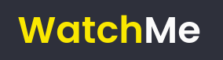
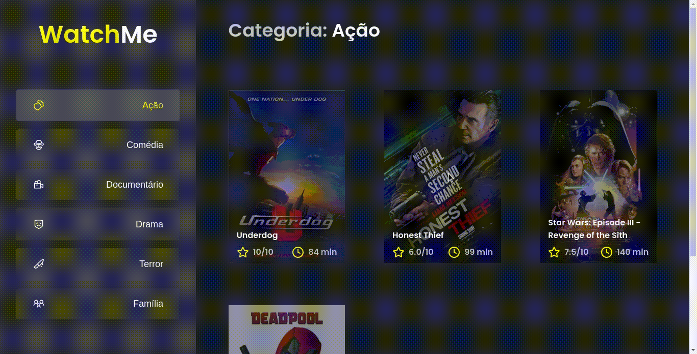

	
	
  
  
  <a href="https://github.com/caiofuccio">
	  
	<a/>

 

<h1  align="center">
  
</h1>

<h4 align="center">
    🎥 to.do | Lista de Filmes por Categoria 🎥
     
</h4>

 <a href="#-sobre">Sobre</a> •
 <a href="#-funcionalidades">Funcionalidades</a> •
 <a href="#-layout">Layout</a> • 
 <a href="#-como-executar">Como executar</a> • 
 <a href="#-tecnologias">Tecnologias</a> • 
 <a href="#-autor">Autor</a>

 

## 💻 Sobre

O WatchMe é uma aplicação para listar filmes de uma database por gênero. São apresentados os posteres dos filmes, notas médias e duração.

Esse projeto faz parte dos desafios da trilha ReactJS do bootcamp Ignite, promovido pela Rocketseat.

Nele foi utilizada uma Fake API com JSON Server para simular uma base de dados da qual os filmes e suas demais características apresentadas são retiradas.
O principal desafio abordado foi a refatoração da página a fim de componetizá-la.

---

## ⚙️ Funcionalidades

- Visualização de um banco de dados de filmes separados por categorias.
- Você pode selecionar as categorias na sidebar à esquerda clicando nos botões.

---

## 🖼️ Layout

---

## 🧰 Como executar

    # Clone o repositório
    $ git clone git@github.com:caiofuccio/films-list.git

    # Instale as dependências
    $ yarn

    # Inicie o servidor JSON
    $ yarn server

    # Execute a aplicação no modo de desenvolvimento
    $ yarn dev

    # A aplicação será aberta na porta:8080 - acesse https://localhost:8080

---

## 🚀 Tecnologias

	
	
	
	 
	
	
  
	 
	
---

## 👨‍💻 Autor

	
	 
	<strong>Caio Fuccio</strong>
	 
	 Front-End Developer | ReactJS
	 
	 
	
	

